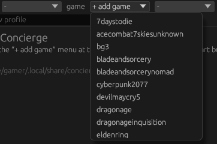
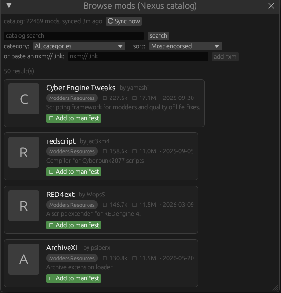
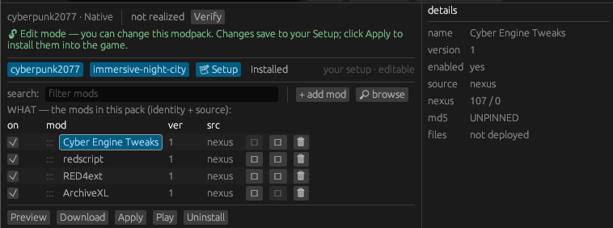
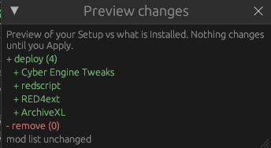
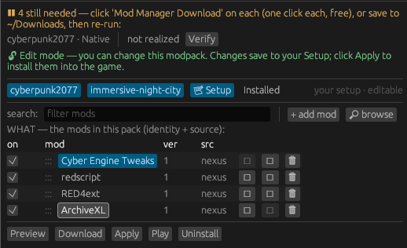

# Concierge

> [!WARNING]
> **Alpha release.** This is a tool I made for myself I thought others may
> benefit from. Please note docs are AI generated for now.

<a href="https://github.com/msmfai/concierge/actions/workflows/ci.yml"></a>
<a href="https://github.com/msmfai/concierge/releases/latest"></a>
<a href="https://github.com/msmfai/concierge/blob/main/LICENSE"></a>


Concierge is a mod manager. Your mod list lives in a text file; Concierge
downloads the mods, verifies them, installs them into a separate copy of the
game, sorts the load order, and launches. The original game install is never
modified.

It is built to be operated by an AI assistant as well as by hand: each pack
carries the instructions an assistant needs, and `concierge shell` runs one in
a sandbox that can only write where the pack allows. You can tell an assistant
what kind of playthrough you want and let it assemble and maintain the pack;
everything it does ends up in the same text file you can inspect and edit.
The command line is the primary interface; there is also a GUI.

## What it does

- Works on about 45 games — the Bethesda titles (Fallout 4, Skyrim,
  Starfield, …), Baldur's Gate 3, KOTOR 1/2, RimWorld, Stardew Valley,
  Minecraft, Valheim, Cyberpunk 2077, Elden Ring, The Sims 4, and others —
  plus a generic mode for unsupported games. Fallout 4 is the most tested;
  the rest have seen less use.
- Downloads from Nexus Mods: automatic with a Premium API key, or a guided
  manual flow without one. Every file is checksum-verified. A local catalog
  of your game's mods is searchable from the CLI and GUI.
- Stores FOMOD installer choices in the pack file and replays them on every
  install, instead of re-running the installer wizard.
- Sorts the load order (LOOT rules) and runs health checks: missing
  dependencies, plugin limits, files that changed on disk, whether your
  original install is still untouched. `preview` shows what an install would
  do before it does it.
- Keeps multiple packs per game; downloads are shared between them. Any
  earlier state can be rolled back to, and `undeploy` removes everything
  Concierge placed.
- On macOS, launches Windows games through CrossOver, including
  script-extender setups.

## A quick tour

Building a pack, start to finish — by hand or with an assistant.

**1 · Pick your game.** Around 45 are supported out of the box — Fallout 4,
Skyrim, Starfield, Cyberpunk 2077, Baldur's Gate 3, RimWorld, and more — plus a
generic mode for the rest.



**2 · Browse the catalog.** Search your game's mods, ranked by endorsements with
real download counts. One click adds a mod to your pack.



**3 · Your pack is a list you own.** Every mod is a row you can toggle, version,
and inspect. Underneath it's a plain text file — no hidden state, nothing you
can't read or edit.



**4 · Preview before anything changes.** See exactly what an install will add or
remove first. Concierge installs into a *separate copy* of the game, so your
original stays pristine — and nothing happens until you click Apply.



**5 · It won't pretend a mod is installed.** If some mods still need downloading, Concierge
says so and tells you exactly how to get them — one click on the mod's page, or
drop the file into your Downloads folder — instead of flashing a green “done”
over an install that isn't actually ready.



**6 · Or let the AI concierge build it.** Open the agent panel and Claude Code
runs inside the pack's sandbox — it can only write where the pack allows, never
your real game. It reads the manifest, runs the checks, and recommends mods.
Tell it the playthrough you want; everything it does lands in the same text file
you can inspect.


## Getting started

Download a build from the
[releases page](https://github.com/msmfai/concierge/releases/latest) — each
archive contains both the `concierge` command-line tool and the `concierge-gui`
app for your platform — or build from source with `cargo build --release`.

**The app** sets itself up on first run: launch `concierge-gui`, use the
**“+ add game”** menu to pick your game, then create a profile — no paths or
config files to hand-edit to get started.

**The command line** scaffolds a profile for you:

```sh
concierge init --game fallout4 my-pack   # scaffold a profile folder
$EDITOR my-pack/manifest.toml            # set where your game lives
export CONCIERGE_REPO=$PWD/my-pack

concierge preview                    # show what would be installed
concierge realize --sort             # download, install, sort
concierge doctor                     # health check
concierge launch                     # run the game
```

To let an assistant do the work instead:

```sh
concierge shell --agent claude       # sandboxed agent session in the pack
```

Runtime dependency: `bsdtar` (preinstalled on macOS and Windows 10+;
`libarchive-tools` on Linux). More detail in [docs/](docs/); per-version notes
are on the [releases page](https://github.com/msmfai/concierge/releases).

## Modeled on how people actually mod

Every modding scene grew up differently, and Concierge follows those grooves
instead of flattening them into one clean abstraction. It is opinionated on
purpose.

- **Foundational tools are promoted, not filed away as ordinary mods.** A
  script extender — SKSE, F4SE, and the other xSE loaders — is not just another
  row in the list: Concierge installs it to the game root, launches the game
  through it, and surfaces it as the foundational thing it is. Each game's crate
  decides what it promotes (a game with no such tool promotes nothing), and it
  stays optional — you choose whether to install one.
- **It mirrors the conventions the community actually built**, rather than
  inventing its own: LOOT rules for load order, FOMOD installer choices recorded
  once and replayed, and last-in-wins file overwrite the way MO2 and Vortex
  trained everyone to expect.
- **No forced universal model.** There is deliberately no grand cross-game
  ontology in the core — the core only knows how to download, verify, deploy,
  sort, and roll back, while each game crate carries that game's real
  conventions. Being opinionated per community beats being uniformly wrong.

## Contributing

Bug reports and feature requests: [issues](https://github.com/msmfai/concierge/issues).
Code contributions: see [CONTRIBUTING.md](CONTRIBUTING.md).

## License

[GPL-3.0](LICENSE).
